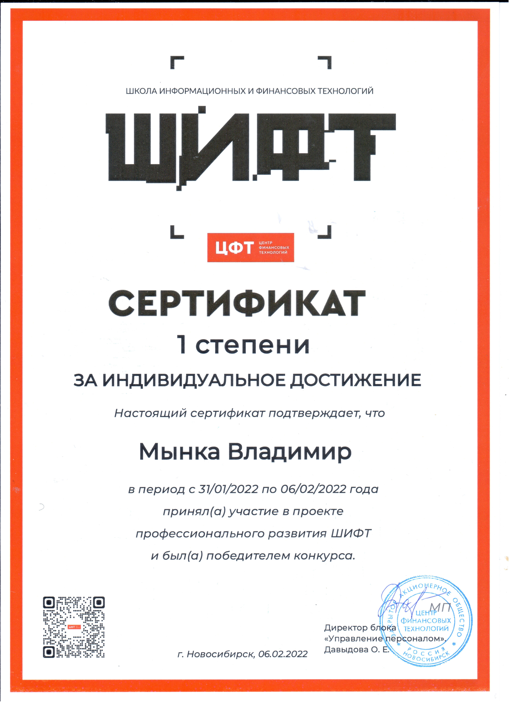

> # Мынка Владимир Александрович
> ### 19 лет, Томск
> ### ТГУ, Высшая IT-школа, 2 курс
> #### Направление стажировки: машинное обучение
> :telephone: +79138706207  
> :e-mail: vladimirmynka34821@gmail.com  
> 

---

**Основное:**
* Знаю `python`, библиотеки `numpy`, `pandas`, `matplotlib`, `pillow`, `scikit-learn`. Работал в обыкновенном `jupyter`, а также в `google colab` и на `Kaggle`.
* В прошлом году [писал](https://github.com/VladimirMynka/Neural-Network) с нуля `обыкновенный перцептрон` на JavaScript. Он использовался для распознавания цифр по рисунку. Знаю устройство `Decision Tree`, `Random Forest`, `CNN`, `ResNet` работал с `LSTM`, сейчас изучаю модель `Transformer` и механизм `Attention`.
* Работал над проектом в области OCR, решал задачи валидации и аугментации датасета, улучшения архитектуры моделей.
* Знаю `теорию вероятностей` и `математическую статистику`. Увлекаюсь математикой. Уже три года веду [сообщество](https://vk.com/mathemynka) ВКонтакте, в котором публикую свои `статьи на математические темы`, написанные бытовым языком. Активно пользуюсь [mathcha.io](https://www.mathcha.io/). Исследую открытую проблему математики, промежуточные результаты исследования можно прочитать по [ссылке](https://comgrid.ru/MagicSquare/MagicSquare.pdf).
* Хорошо умею работать с `PostgreSQL` (реализовывал в этой СУБД базы данных для учебных ПрО: "больница", "армия"), работал с реляционными базами данных `Oracle`. Пишу `SQL запросы` на высоком уровне (в том числе, рекурсивные). Из `NoSQL` - графовая модель (`Neo4j` и язык запросов `Cypher`), знаком с другими моделями хранения данных. Есть навыки семантического моделирования баз данных
* Имею большой опыт в программировании. Кроме `python`, писал на `C++`, `C#`, `Kotlin`, `Java`, `JavaScript` и `TypeScript`. 
* Был `победителем интенсива ЦФТ ШИФТ` по направлению "машинное обучение". Подтверждающий сертификат ниже.
* Сейчас прохожу практику по машинному обучению в `лаборатории ЦФТ ШИФТ`.
* Участвую в `интенсиве rucode` по направлению ИИ.

---

**Дополнительно:**
- Хорошо знаком с `фронтендом`, имею опыт `мобильной разработки`, `бэкенд-разработки` и `разработки игр`. Качественно проектирую средние по сложности системы на уровне описания ПрО и архитектуры (язык - `UML`)
- Работал с `консолями linux и windows`, писал скрипты в формате `.sh`, знаю большое количество команд.
- Гитхаб: github.com/VladimirMynka. Также большая часть работ хранится в приватных учебных репозиториях на гитлабе, к ним, к сожалению, предоставить доступ не могу.
- Несколько раз пробовал себя в роли `тимлида` в различных проектах, сейчас `руковожу разработкой социальной сети`, общение в которой реализуется по принципу гугл-таблиц: [comgrid.ru](https://comgrid.ru).
- Знаком с языками разметки `LaTeX`, `Markdown`

Мой аккаунт на Kaggle: [vladimirmynka](https://www.kaggle.com/vladimirmynka)
 
